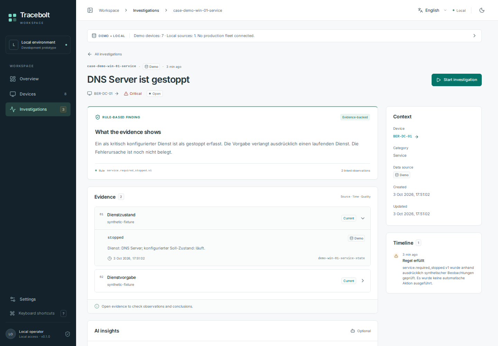

# Tracebolt

Evidence-first endpoint diagnostics, built for a self-hosted future.

Tracebolt is an early self-hosted diagnostics prototype with a React interface, a Go manager, evidence-linked investigations and bounded native collectors. The development manager provides synthetic demonstrations. A separate single-operator LAN manager implements authenticated operator access and manually approved agent ingress; its new browser and container gates remain commit-specific CI checks.

**This is a development pilot, not a production release.** Real LAN deployment, installed agent services, certificate provisioning, production audit/backup controls and fleet-scale acceptance remain open. Do not expose the loopback development manager to a network.

## Installation

Start with the **[installation runbook for humans and automation agents](docs/installation.md)**. It covers Docker/native Linux setup, manual public-certificate approval, the one-shot Linux sender, verification, recovery and explicit permission boundaries. [AGENTS.md](AGENTS.md) is the repository entry guide.

## Screenshots

[View the verified English/German viewport gallery](docs/screenshots/2026-10-03-lan-ui/README.md): desktop/mobile, light/dark, fixed navigation while content scrolls, explicit AI-test-provider scenes and HTTP-test login/awaiting states. All twelve captures are synthetic, unedited, pixel-reviewed and pinned to source `b4a6f40` with original hashes.



The [earlier preview gallery](docs/screenshots/2026-10-03-ui-preview/README.md) remains historical. The current gallery's AI scenes are labelled **Testanbieter / keine reale Modellanalyse**, and HTTP-test scenes do not represent a trusted TLS deployment.

## Run the local development demo

Requirements: Go 1.27.1 (the version in `go.mod`), Node.js 24 with npm, a C toolchain for race-detector tests, and `make`. Python 3 and curl are used by boundary regressions. No database server or container runtime is required.

```sh
make web
make build
./bin/manager
```

Open **http://127.0.0.1:8787**. The manager serves the built UI and API from the same origin and stores local state in `.local/state.db`. Do not use a separate frontend dev-server origin for mutations. For UI development, run `cd web && npm run dev` in another terminal to rebuild on changes, then reload the manager page.

The JSON API is also available:

```sh
curl http://127.0.0.1:8787/api/health
curl http://127.0.0.1:8787/api/overview
curl http://127.0.0.1:8787/api/capabilities
```

For a disposable session or a different port:

```sh
./bin/manager --port 8788 --db .local/experiment.db
```

Stop with Ctrl+C. The database persists notes and case status across restarts. It is not encrypted. Keep it private and use synthetic data only. Copy the closed database for a local backup; do not commit it.

The standalone collector emits a single bounded JSON observation to stdout and exits:

```sh
./bin/agent --once
```

It does not contact a server, enroll a device, execute commands, or install a service. A bounded, schema-versioned support bundle is also available:

```sh
./bin/agent --support-bundle > support-bundle.json
```

This writes local stdout only, capped at 64 KiB. Review the file before sharing it; this command does not upload it. See the [support bundle contract](docs/support-bundle.md).

## Investigation interface

- English by default with a persisted German language switch
- Light and dark themes, desktop and narrow-screen layouts with independently scrolling content
- Searchable inventory with OS, status and source filters, sorting, saved local views, and CSV export
- Device details with collection provenance, capability boundaries, and expandable evidence
- Case investigations with read-only next steps, durable notes, and status transitions
- Explicit loading, missing-data, stale-data, and error states
- Keyboard navigation, focus-contained device dialogs, and Back/Forward navigation

The interface uses the real local API. Browser acceptance and screenshots are produced by the same-origin Playwright workflow; inspect the exact commit's CI outcome rather than assuming every rendered state has passed.

## Separate LAN manager and Docker packaging

`make build` also builds `bin/lan-manager`. It starts only with an explicit protected configuration:

```sh
./bin/lan-manager --lan-config /absolute/path/lan.json
```

Read the [LAN runtime contract](docs/lan-runtime.md) before providing configuration. The default TLS profile uses separate operator HTTPS and agent mTLS listeners, a preprovided operator password verifier, bounded sessions/CSRF, manual public-leaf approval and durable replay/revocation state. The LAN runtime starts without demo devices or fallback host sampling. Approved agents awaiting their first observation remain unknown. Current diagnostics do not turn synthetic demo rules into real LAN findings.

An explicitly enabled [HTTP test profile](docs/signed-http-test.md) uses separate disposable authentication/state and signed telemetry. **HTTP exposes operator passwords, sessions and telemetry on the network; signatures do not encrypt them or authenticate the browser UI.** A permanent warning is shown before and after login. Use this only for deliberate isolated testing with test-only material.

[Docker packaging and Compose examples](docs/docker.md) provide an optional Linux server route. The image runs as a fixed nonroot user with a read-only root filesystem and dropped capabilities. Endpoint collectors remain native. CI builds a local image and exercises both disposable profiles on a standard Linux runner; check this commit's actual outcome before treating container execution as verified. No registry publication or real deployment is part of the workflow.

A [native one-shot Linux sender](docs/lan-agent.md) now collects and delivers one bounded observation using preprovided approved material. Its private durable state preserves exact request bytes across uncertain delivery/restart and binds them to the configured destination and identity. Run `bin/lan-agent --config /absolute/path/agent.json` after following that contract. [Two-binary runtime tests](tests/lanclient/README.md) exercise the actual manager and sender over both loopback profiles. Windows/macOS sender state protection, installed services and continuous scheduling remain unimplemented. Certificate issuance, trusted browser TLS setup and real endpoint provisioning are separate work.

## Optional previews

- [AI-assisted investigation](docs/ai-diagnostics.md): configure an OpenAI-compatible provider, inspect the bounded evidence packet and destination, then explicitly approve an analysis. Provider configuration and keys are memory-only. Suggestions remain unconfirmed and cannot execute actions. Validation so far uses a deterministic loopback test provider, not a real model.
- [Local agent transport preview](docs/local-transport-preview.md): start the manager with `--managed-preview`, then run the separate one-shot development sender. The manager starts with unknown/awaiting data and never substitutes its own sampler. This is loopback-only development transport, not authenticated enrollment or LAN support.

## Assessment foundation

An [isolated read-only inventory and synthetic CVE-assessment foundation](docs/assessment-foundation.md) is available for further development. Live advisory import, verified package-origin adapters, offered-update adapters, and UI/API integration remain unimplemented. **This does not yet show real missing updates or CVEs in Tracebolt.** The [implementation plan](docs/update-vulnerability-plan.md) records the remaining platform, provenance and release gates.

## What the data means

- Seven Windows, Linux, and macOS demo devices, their histories, cases, and evidence are synthetic fixtures.
- The additional live Linux sample reads only fixed local OS and kernel sources for CPU, memory, filesystem usage, OS label, and uptime. A sandbox may share a kernel or expose host-wide readings; attribution and container limits are unknown.
- `healthy` metric quality means the observation was collected successfully. It is not a security or endpoint-health verdict.
- Missing, denied, stale, and unsupported observations remain visible. No language model is connected by default. Diagnostic rules and optional AI suggestions do not claim proven root causes.
- Windows and macOS have limited implemented read-only adapters. Provider tests and cross-compilation check code contracts and buildability; installation, lifecycle, ordinary-user permission parity, signing, and distribution remain unvalidated. A bounded CLI smoke passed on hosted Windows amd64 and macOS arm64 at [2bccc168](https://github.com/storminator89/Tracebolt/actions/runs/37130214233). Windows CPU and macOS CPU/RAM utilization remain explicitly unknown. See [native collection and verification](docs/native-collection.md).

## Validate

```sh
go vet ./...
make test
make build
make crosscheck
bash tests/security/run.sh
(cd web && npm ci && npm run typecheck && npm test && npm run build)
```

`make crosscheck` builds the agent for Windows amd64 and macOS arm64. It does not run those binaries. GitHub Actions validates Go, UI types/tests/build, disposable HTTP boundary checks, and same-origin Chromium workflows on standard Linux runners. It does not deploy a website or install agents on real endpoints.

For browser acceptance locally, install Chromium with `cd web && npx playwright install chromium`, return to the repository root, then run `node tests/e2e-review/run.mjs`. This creates an isolated manager and database. See [browser acceptance](tests/e2e-review/README.md) for scope and screenshot privacy rules.

## Security boundary

The development manager combines a fixed loopback listener, loopback peer check, exact Host and Origin checks, mutation CSRF tokens, no CORS, bounded request bodies, and canonical paths. These reduce common browser-to-local-service attacks, but they are not user authentication. Other processes or users able to reach the loopback service can access its local data. Never reverse-proxy, tunnel, or publish the manager.

Case notes are local text. Runbooks are read-only suggestions. There is no arbitrary shell, remote control, privileged remediation, network scan, patch installation, or automatic update path.

The separate LAN implementation adds operator sessions, approved endpoint identity and revocation. Its [targeted security review](docs/lan-security-review.md) records exact verification and remaining gates. Protected audit records, multi-operator roles, signed agent distribution, retention/backup controls, native service acceptance and a deployment review are still required before production use. The current dependency review found no reachable or imported-package advisory, but records an unused OpenPGP advisory in a required module; it is not a blanket advisory-free claim.

## Project map

- `cmd/manager`: loopback development manager
- `cmd/agent`: single-sample, read-only collector command
- `cmd/dev-agent`: one-shot loopback development sender
- `cmd/lan-manager`: separate explicitly configured operator/agent runtime
- `cmd/lan-agent`: Linux one-shot sender with protected exact-retry state
- `internal/operatorauth`, `lantrust`, `lanstore`, `signedhttp`: session, identity, replay and transport boundaries
- `tests/container`: opt-in disposable TLS/HTTP-test lifecycle checks
- `internal/api`: request boundaries and API handlers
- `internal/collector`: bounded local observations and platform adapters
- `internal/store`: SQLite persistence
- `internal/bundle`: bounded support-bundle export contract
- `web`: React/TypeScript interface
- `tests/security`: independent boundary and bundle regressions
- `tests/e2e-review`: same-origin browser acceptance and screenshot capture
- `internal/fixtures` and `internal/rules`: synthetic scenarios and deterministic findings
- [API contract](docs/api-contract.json)
- [Product scope and release gates](docs/product-plan.md)
- [Research-backed MVP priorities](docs/competitor-mvp-priorities.md)
- [Scoped security review and verification](docs/security-review.md)

## License

A project license has not been selected. Public source availability is not an open-source license grant. Dependencies retain their own licenses.
