# Verified bilingual UI gallery

These are twelve **unedited, actual Chromium viewport captures** from source [`b4a6f40ce9193f9ee91290eb2c50eb07ab8819a9`](https://github.com/storminator89/Tracebolt/commit/b4a6f40ce9193f9ee91290eb2c50eb07ab8819a9), captured by [CI run 37142090350](https://github.com/storminator89/Tracebolt/actions/runs/37142090350). The gallery publication commit may be newer; that does not change the captured source.

The exact run passed 40 general/AI/language/layout checks, 6 managed-preview checks and 10 authenticated HTTP-test browser checks with zero runtime errors. Separate jobs passed actual Linux manager-container TLS/HTTP lifecycle and native collector CLI smoke on Linux, Windows and macOS. These are bounded development checks, not production deployment or installed-service acceptance.

Each image was independently inspected at its actual pixels. All are synthetic fixtures. Screenshots use `fullPage:false`: desktop 1440×1000 and mobile 390×844. The content pane owns scrolling while navigation and the topbar stay inside the viewport. Images are not digitally cropped, retouched or assembled. [Manifest, captions, original SHA-256 hashes and source association](manifest.json).

English is the default interface language; German can be selected and persisted. Original evidence and model-response text remain in their source language. No real endpoint telemetry, passwords, session cookies or API-key values are shown. AI settings capture the key field empty.

**AI disclosure: Testanbieter / keine reale Modellanalyse.** AI scenes use a deterministic loopback test provider and synthetic evidence. They do not demonstrate real-model accuracy. HTTP-test scenes use the real handler on loopback with a synthetic awaiting-agent contract; they do not prove a deployed endpoint, enrollment or trusted-TLS browser operation. Plain HTTP exposes passwords, sessions and data; the warning remains visible.

## 1. English inventory, light theme. Windows demo fixtures; no real endpoint measurements.

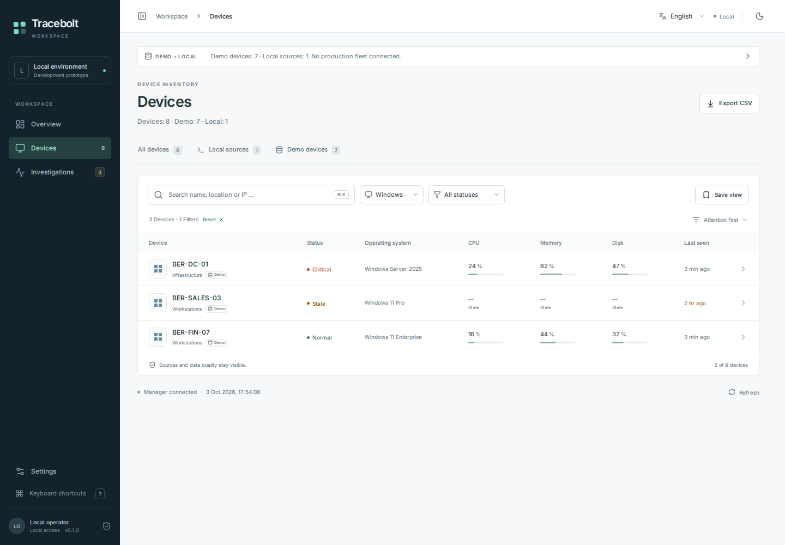

## 2. English inventory, dark theme. The same synthetic Windows inventory with explicit stale and unknown-value handling.

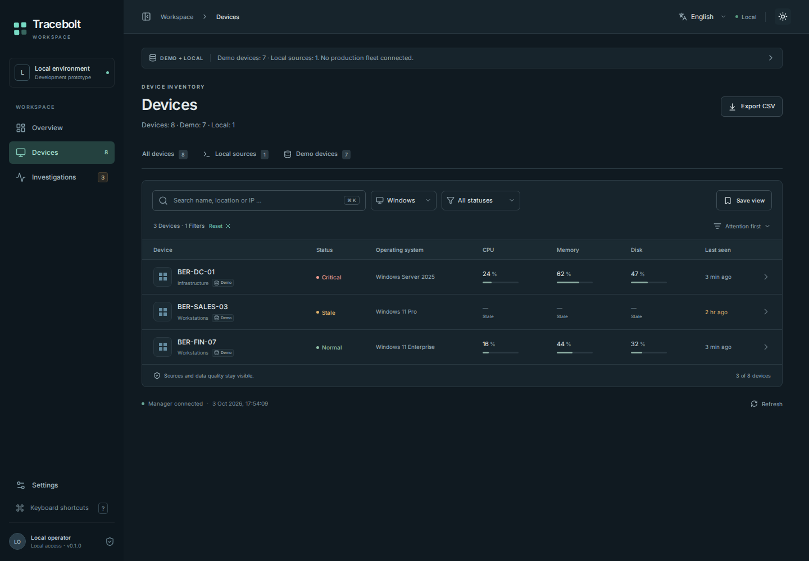

## 3. English inventory at 390×844. Synthetic Windows fixtures with responsive filters and source labels.

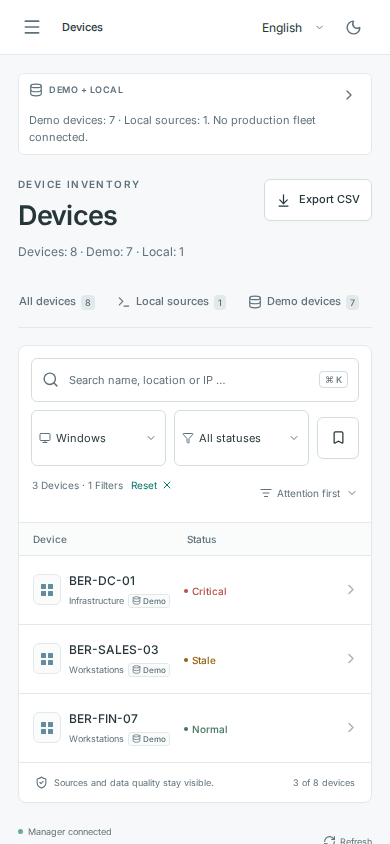

## 4. English device drawer at 390×844. Synthetic Windows evidence; the original observation text is preserved.

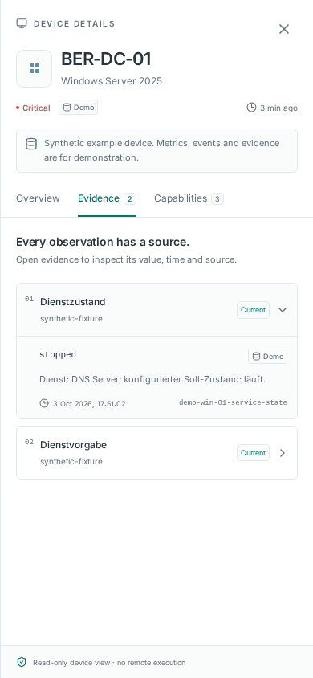

## 5. English investigation view of a synthetic Windows case. Original evidence prose remains in its source language.

## 6. German investigation view, scrolled inside the content pane. Synthetic Linux case; the topbar and sidebar remain fixed in the viewport.

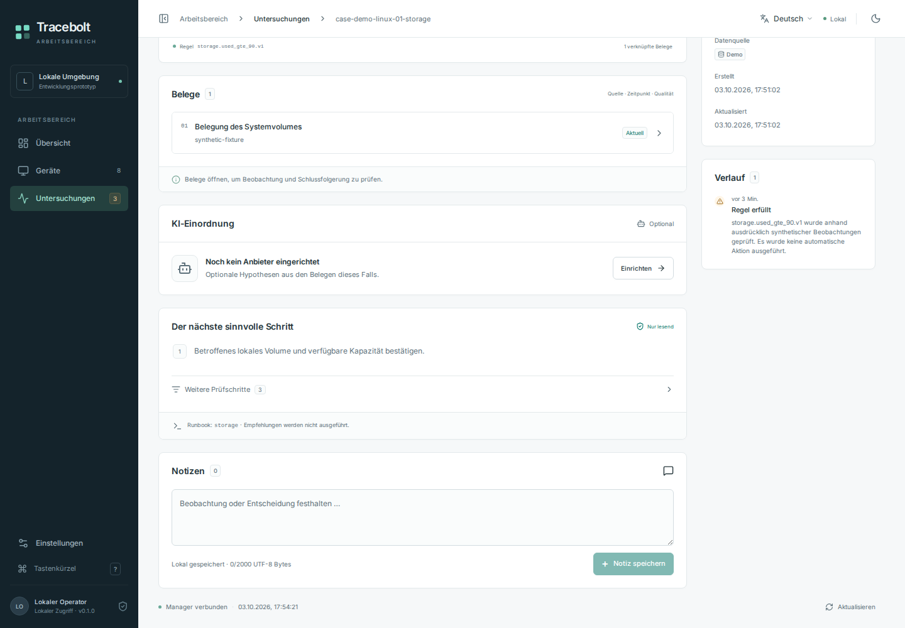

## 7. German AI settings with an empty API-key input. Testanbieter / keine reale Modellanalyse: controlled loopback provider configuration, not a real inference.

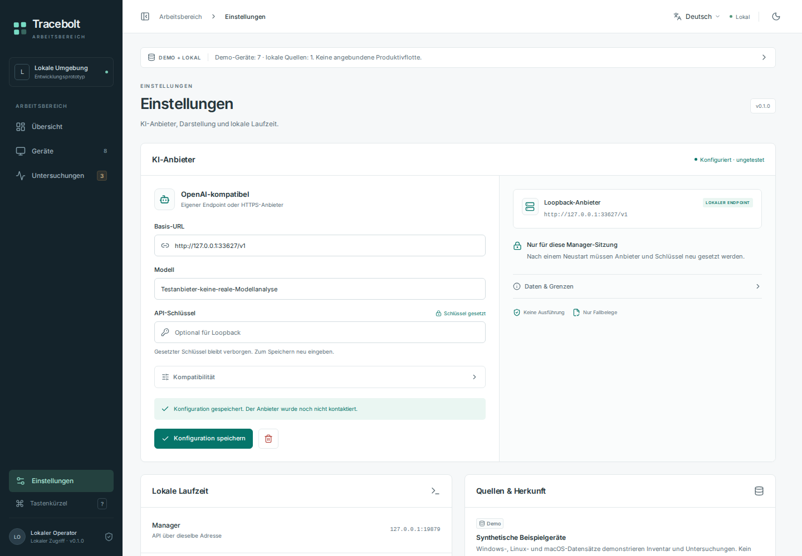

## 8. German AI result, dark theme. Testanbieter / keine reale Modellanalyse: controlled response to synthetic case evidence; cause explicitly unconfirmed.

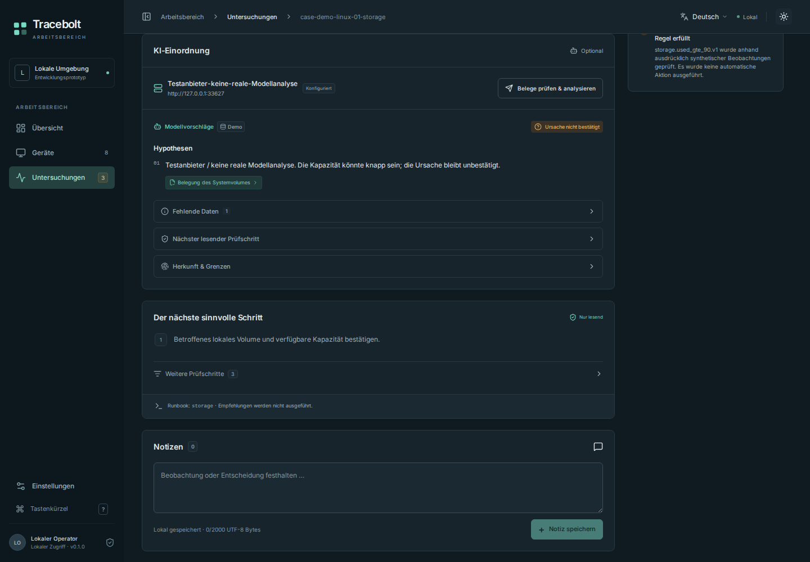

## 9. German mobile AI result with stable header. Testanbieter / keine reale Modellanalyse: controlled response with cited synthetic evidence.

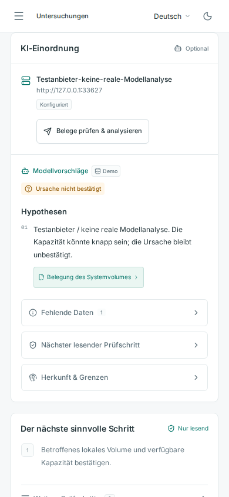

## 10. German mobile evidence-transfer confirmation. Testanbieter / keine reale Modellanalyse: explicit destination and one-request consent for a controlled loopback provider.

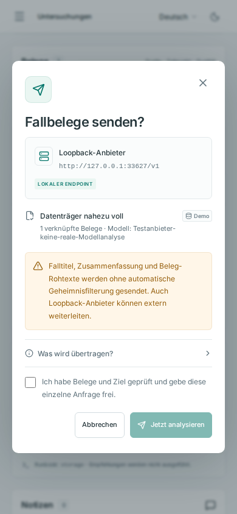

## 11. English mobile sign-in for the explicit unencrypted HTTP-test profile. Empty password field and permanent risk warning; loopback test fixture, not a trusted TLS deployment.

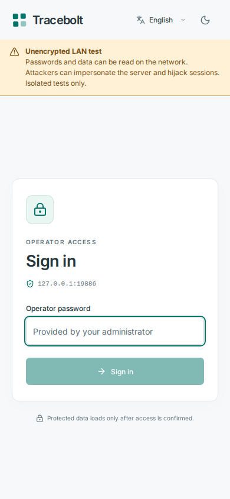

## 12. English authenticated HTTP-test view using a synthetic awaiting-agent contract. No real enrolled endpoint or telemetry; unknown data and unavailable assessment remain explicit.

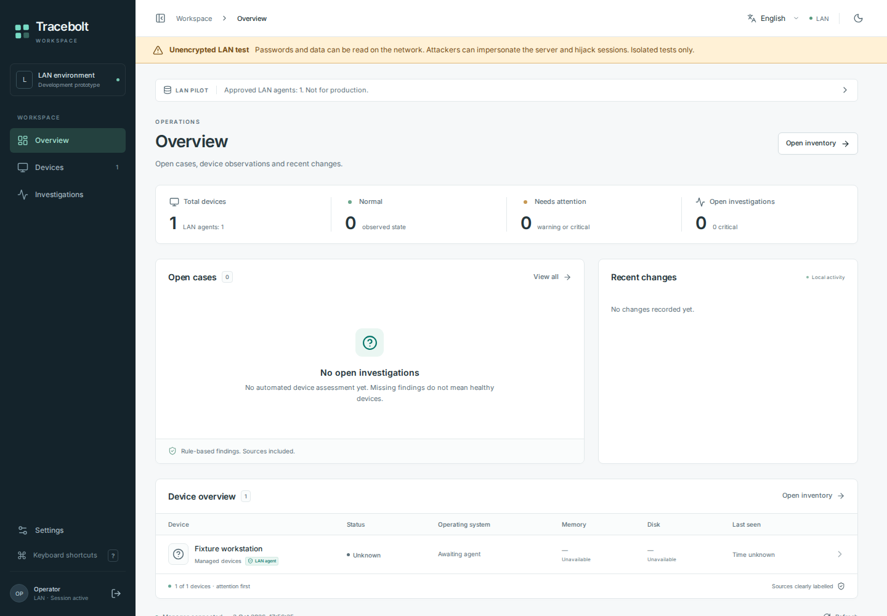

