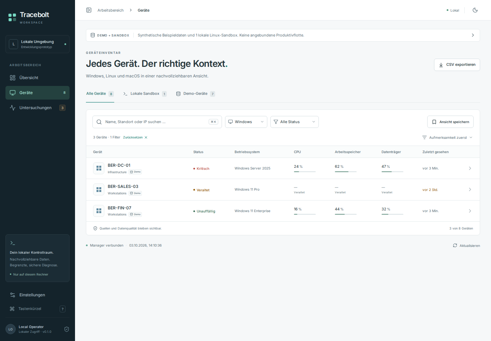
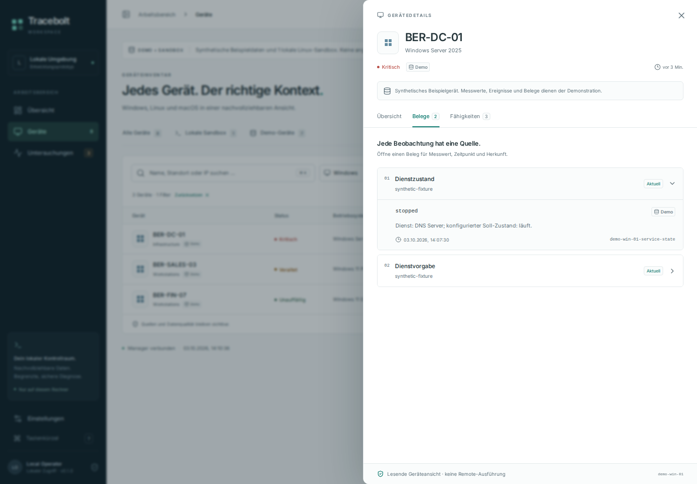
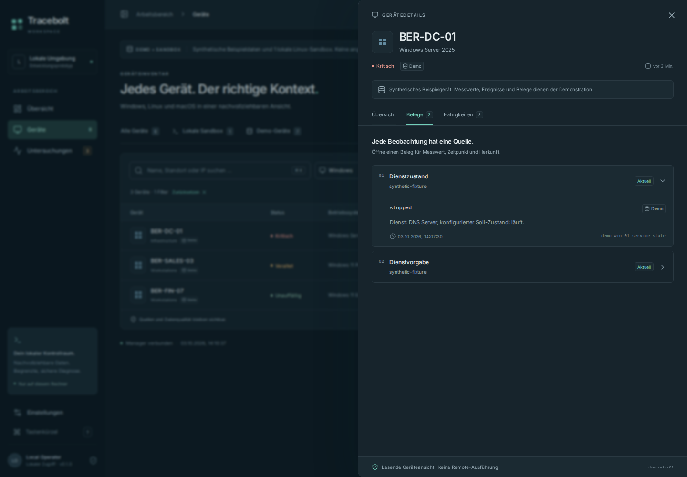
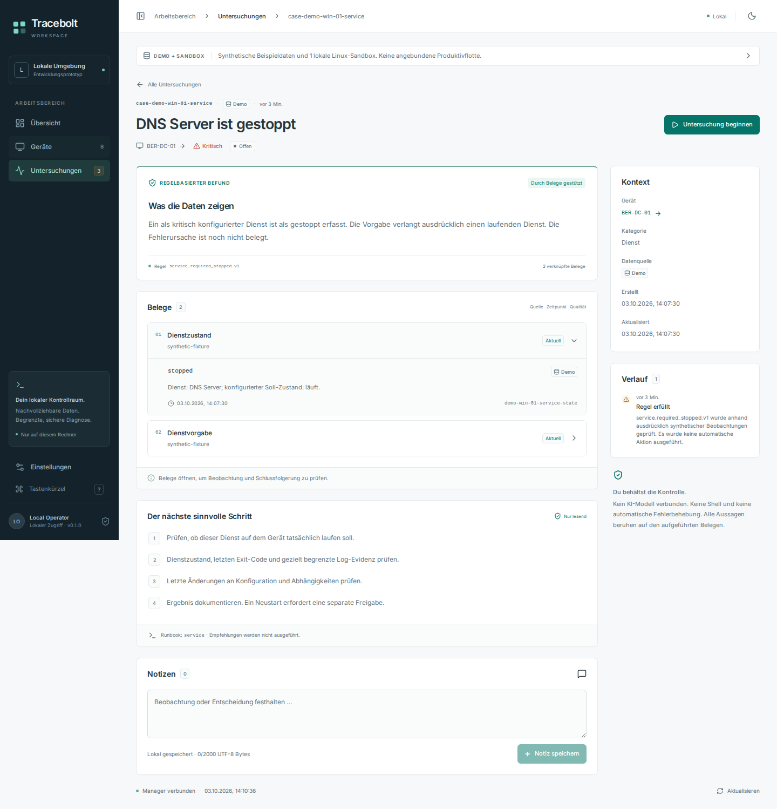
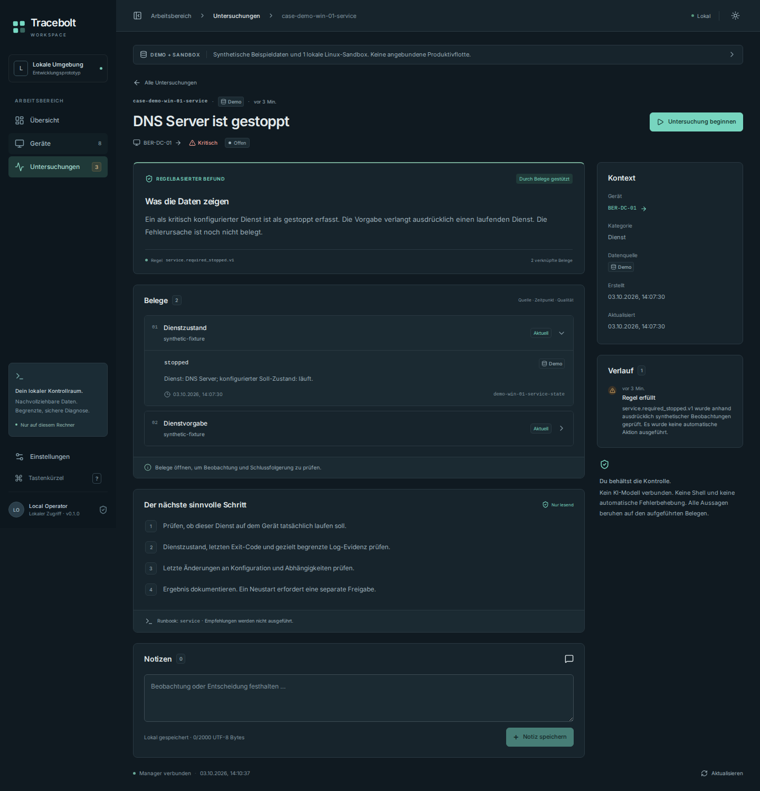
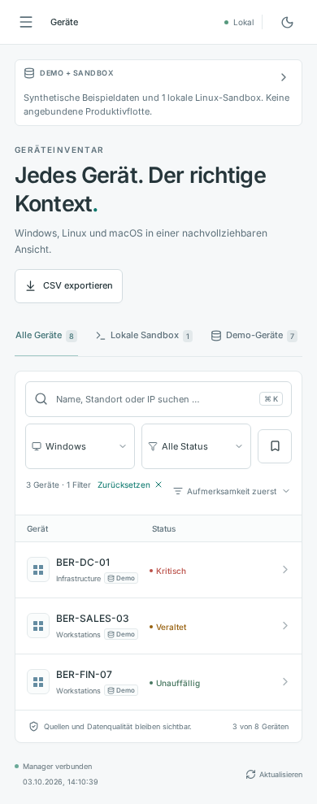
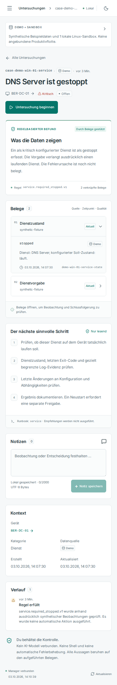
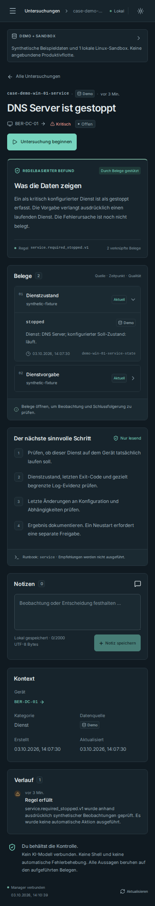

# Tracebolt UI preview — 2026-10-03

Actual Chromium captures from the working same-origin Go manager and React UI. Every displayed device and case in this gallery is synthetic. These are screenshots, not mockups.

Source: [594e88eee0e45060374a2c1049be711a96b58d37](https://github.com/storminator89/Tracebolt/commit/594e88eee0e45060374a2c1049be711a96b58d37). [Browser run](https://github.com/storminator89/Tracebolt/actions/runs/37128509338): 25 scenarios passed, 0 failed, 0 uncaught runtime errors.

The desktop viewport is 1440×1000; mobile emulation is 390×844. Full-page captures can be taller than the viewport. Responsive Chromium evidence does not establish native mobile-device or Windows/macOS agent acceptance.

[Capture metadata and SHA-256 hashes](manifest.json).

## Desktop

### Inventory

Light theme

### Device evidence

Light theme

Dark theme

### Investigation

Light theme

Dark theme

## Mobile

### Inventory

Light theme

### Investigation

Light theme

Dark theme

