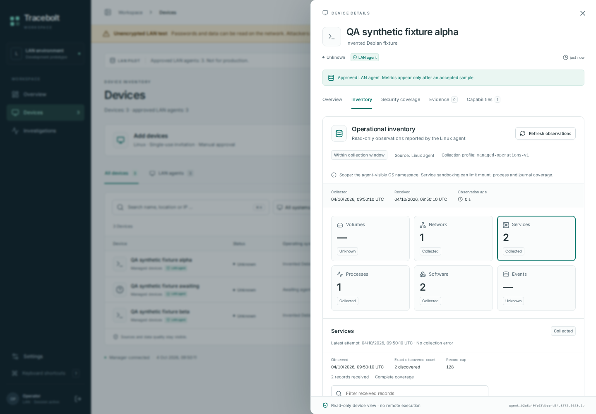
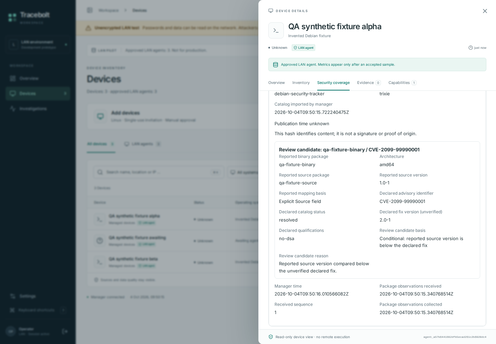
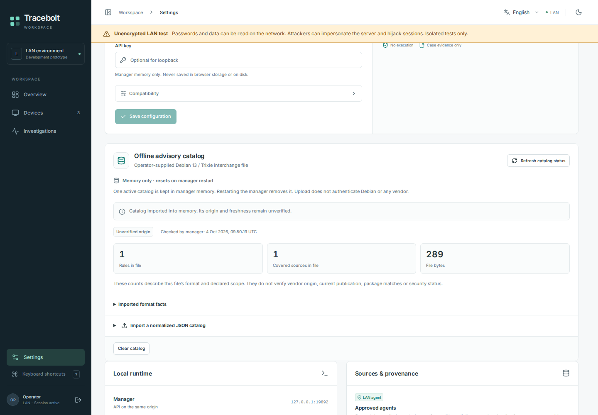
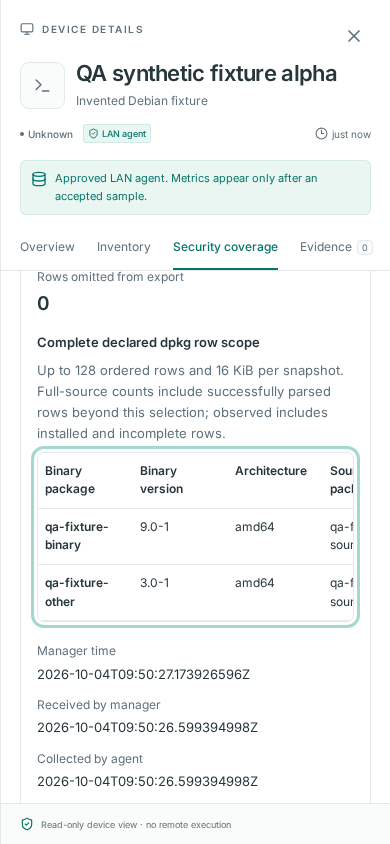

# Linux inventory and conditional review UI

Four original, unedited browser screenshots from source [`ed18d9a`](https://github.com/storminator89/Tracebolt/commit/ed18d9ab0dd88a14ea86eaec1548facd807ecc22), captured in [CI run37193131587](https://github.com/storminator89/Tracebolt/actions/runs/37193131587). The new target passed18/18 cases with zero runtime errors. These captures show entirely invented QA data on a loopback HTTP-test setup.

The operational document retains its v1 component profile inside the v2 enrollment frame. Catalog fixtures are unverified; their invented candidate rows do not establish vulnerabilities or offered updates. No real endpoint telemetry, credential material or installed-service acceptance is shown. Original PNG hashes, dimensions, source and detailed scope are in [gallery-selection.json](gallery-selection.json).

## Operational inventory

Operational inventory overview with section counts, unknown sections, collection/receipt times and fixed device navigation. Entirely invented QA data on the loopback HTTP-test profile. The disposable fixture uses the managed-operations-v2 binding; operational records retain their declared v1 component profile. No real endpoint telemetry or installed-service acceptance is shown.

## Conditional review detail

Scrolled desktop advisory review detail. Invented package source version 1.0-1 is compared with an unverified declared fix 2.0-1; this is a conditional candidate, not a verified vulnerability or offered update. The invented catalog declares synthetic:false only to exercise the unverified interchange path. Entirely invented QA data on the loopback HTTP-test profile. The disposable fixture uses the managed-operations-v2 binding; operational records retain their declared v1 component profile. No real endpoint telemetry or installed-service acceptance is shown.

## Offline catalog settings

Offline catalog settings with memory-only storage, explicit unverified origin/freshness, and persistent unencrypted-test warning. File-format counts are not vulnerability counts. The invented catalog declares synthetic:false for the fixture. The API-key field is empty. Entirely invented QA data on the loopback HTTP-test profile. The disposable fixture uses the managed-operations-v2 binding; operational records retain their declared v1 component profile. No real endpoint telemetry or installed-service acceptance is shown.

## Mobile package table

Scrolled English mobile package table with visible keyboard focus and a bounded horizontal scroll region. Additional source-package columns extend within the table; this is a partial viewport, not the complete inventory. Entirely invented QA data on the loopback HTTP-test profile. The disposable fixture uses the managed-operations-v2 binding; operational records retain their declared v1 component profile. No real endpoint telemetry or installed-service acceptance is shown.

