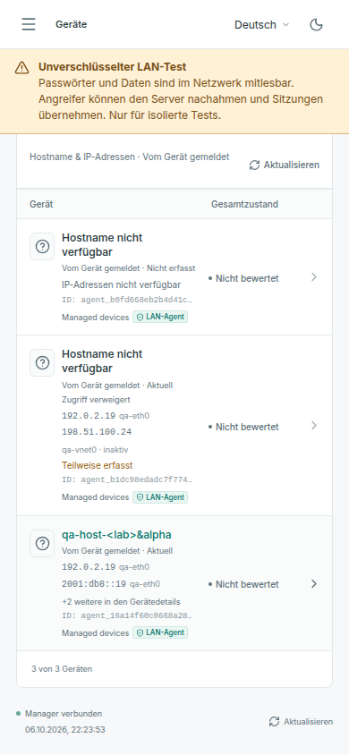
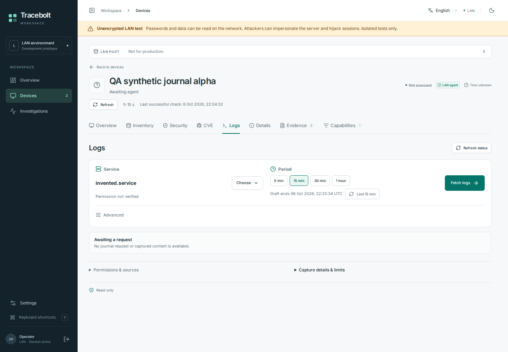

# Fleet identity and log-window UI

These are actual Playwright Chromium captures from source
[`a6c8c8a`](https://github.com/storminator89/Tracebolt/commit/a6c8c8aabac32dbe2571fe3863e25c17bc8b6300),
[hosted browser job112529010119](https://github.com/storminator89/Tracebolt/actions/runs/37539228840/job/112529010119).
The fleet mobile and journal scenarios shown here passed. The overall job had
separate alarm-scroll and fleet-logout readiness failures; these captures are not
a claim that the whole browser suite or native upgrade passed.

All device identifiers, hostnames, addresses and service data are invented
fixtures. No user-host telemetry, invitation, credential or provider response is
shown. Neither image was generated, edited or cropped.

## Reported hostname and scoped addresses, German mobile

The table preserves unavailable, partial and current observations, with stable IDs
as technical details. Addresses use documentation ranges.

## Exact service and explicit new log window

Last 15 min prepares the draft window. Fetch logs still requires the existing exact
request review; the screenshot contains no captured journal content.

