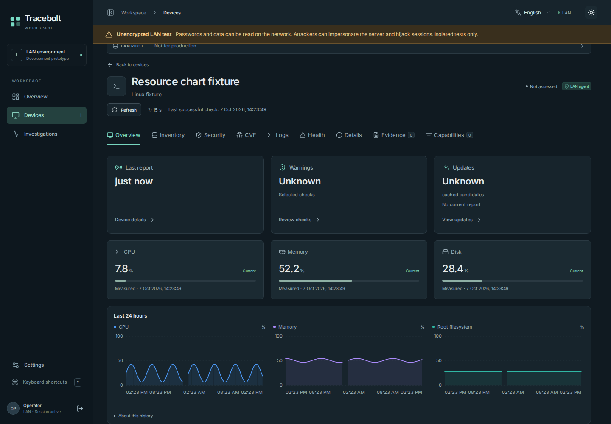
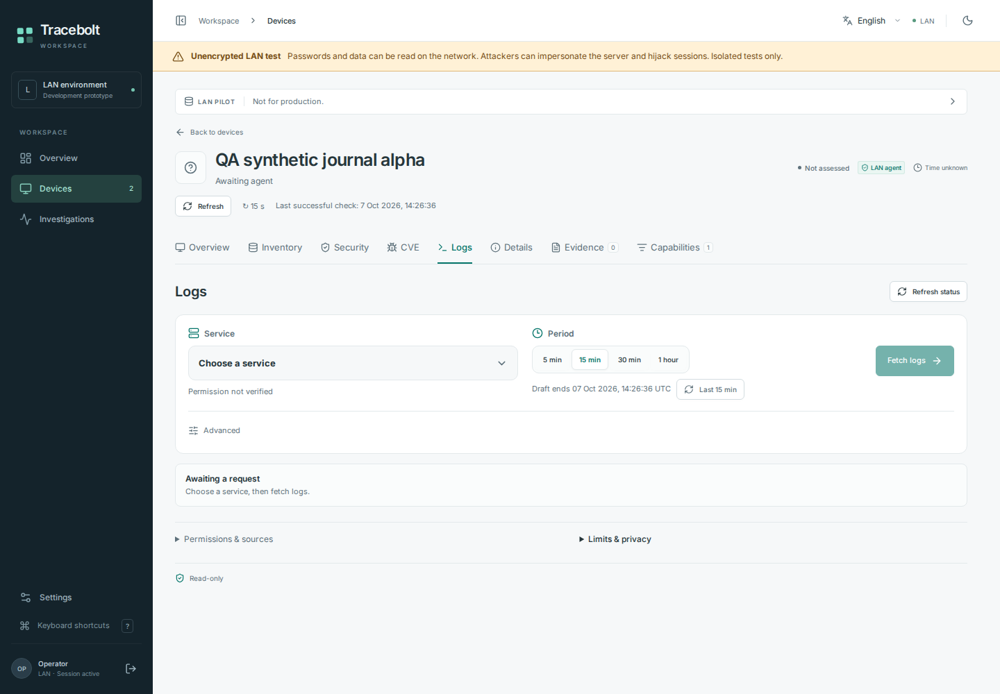

# Dashboard and log workspace

These original Chromium captures use invented data in the actual Tracebolt UI.
No image was cropped, composited or generated, and no user-host telemetry,
invitation, credential or provider response is shown.

Source: [fe6c5a6](https://github.com/storminator89/Tracebolt/commit/fe6c5a6a08fb616e7d5f79dc5faccc20e89db68b).
Evidence: [browser job](https://github.com/storminator89/Tracebolt/actions/runs/37635263778/job/112840864293),
with exact file hashes and case names in [provenance.json](provenance.json).
Both pictured scenarios passed. The run executed133 passing cases with zero case
failures; its two fixed-total evidence checks still expected the older case counts,
and the dependent endpoint capture step was not reached. These pictures establish
rendering of their synthetic scenarios, not a user-host installation or OS reboot.

## Resource history

The dashboard preserves original sample times and visible gaps. Unknown health
and update assessments remain explicit beside the measured resource values.

## Service-scoped log request

Choosing a service and period prepares a request. Fetching content still requires
the exact local grant and explicit request approval; this view has no captured log
content or automatically started collection.

