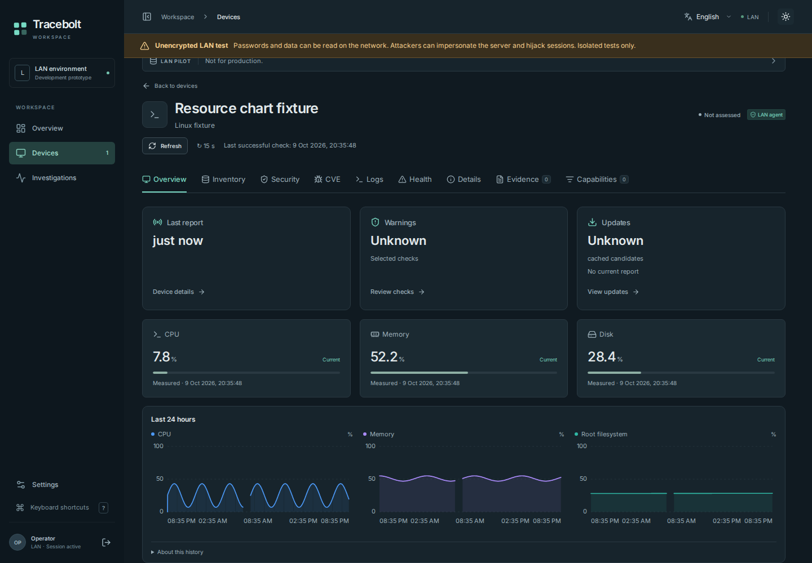
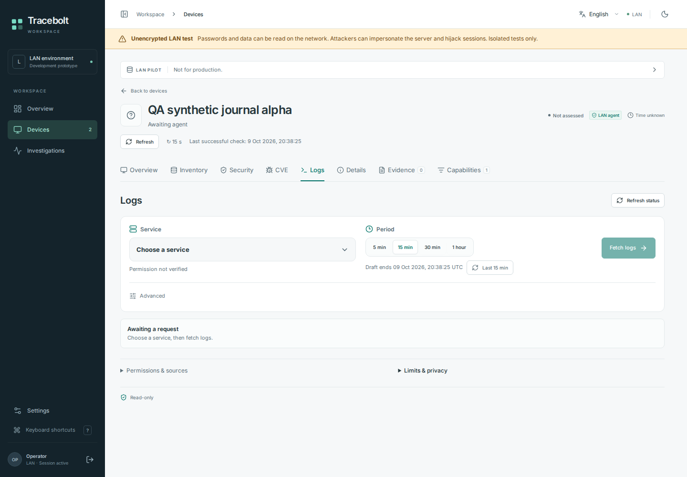
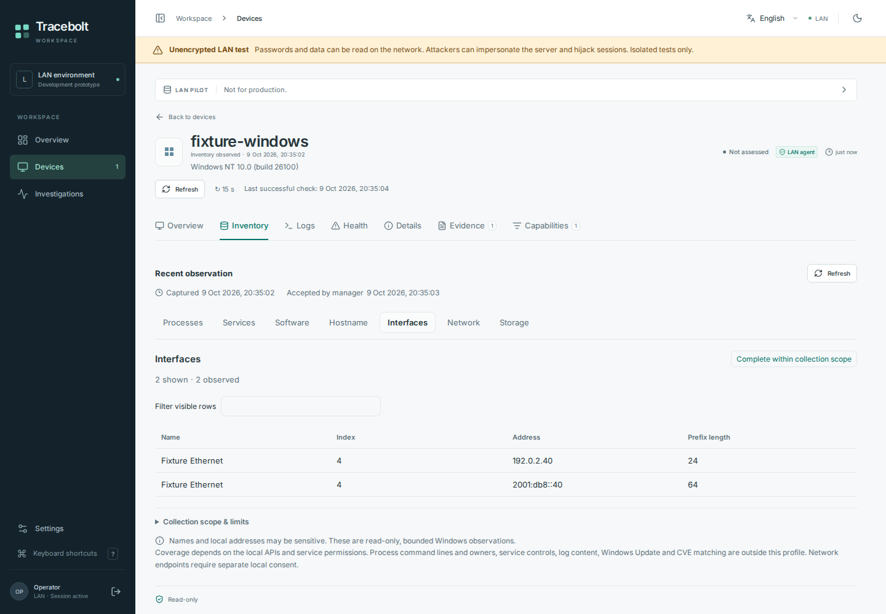
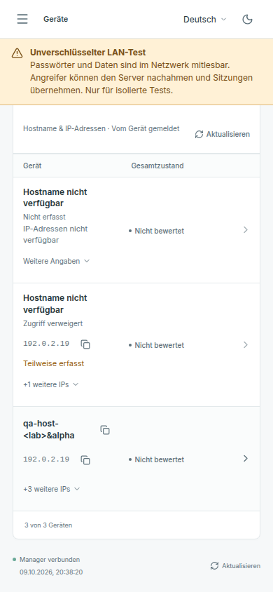

# Dashboard screenshots, 9 October 2026

These are genuine Chromium captures of the compiled Tracebolt UI with invented
test data. The original PNGs were copied unchanged from the successful
[hosted browser job](https://github.com/storminator89/Tracebolt/actions/runs/37986888183/job/114012926640)
on [source 9e6203b6](https://github.com/storminator89/Tracebolt/commit/9e6203b6c17cbc7e4e6f9e35ac86ff4fb664dd20).
No image was generated, retouched, cropped or assembled.

Each selected capture was inspected at its original resolution. The visible
names, IP addresses and measurements are fixtures, and the unencrypted HTTP-test
warning remains visible. No user-host telemetry, secret, invitation or provider
response is shown. These examples demonstrate rendering on this source; they do
not establish a Windows installation, LocalService acceptance, host permission,
production TLS deployment, upgrade or OS reboot.

[Provenance and SHA-256 hashes](provenance.json) record the archive, original
filenames, exact source, passing cases, fixture scope and pixel review. Desktop
captures are 1440 × 1000; the mobile capture is 390 × 844. All are viewport
captures, with no full-page stitching.

## Resource history

The dark-mode overview shows invented CPU, memory and root-filesystem samples.
Original sample times and gaps remain visible, and unknown warning and update
assessments are not turned into healthy results.

## Service-log request

This view prepares an exact service and time window. No service is selected,
permission is not verified, and no journal content has been fetched. A real
request still needs its local grant and explicit request approval.

## Windows inventory

The dashboard renders invented Windows interface observations with
documentation-range IPv4 and IPv6 addresses. The source and collection limits
remain visible. This is UI evidence using intercepted fixture replies, not
evidence of a native Windows installation or service run.

## Mobile fleet, German

The mobile fleet preserves the distinction between unavailable, denied and
partially captured identity data. The escaped hostname and scoped IP addresses
are invented test values; whole-device health remains unassessed.

