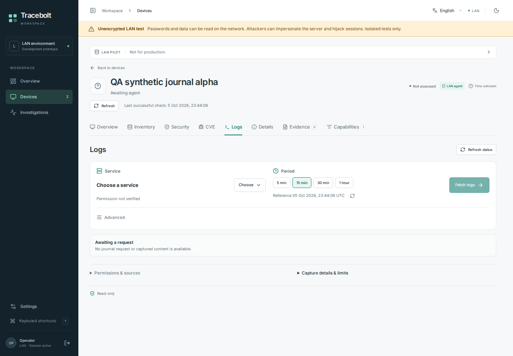
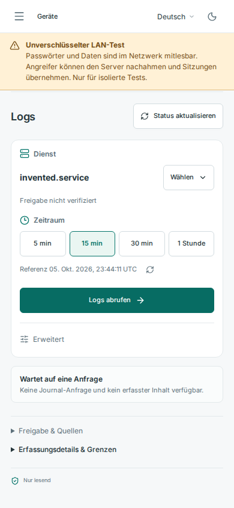

# Logs workspace previews — synthetic test data

These original, unmodified screenshots were captured from exact source
`71dc92cfac754cb33994405669b9274d9bed96c7` in
[the hosted browser run](https://github.com/storminator89/Tracebolt/actions/runs/37389446960).
They show invented journal fixtures through the real authenticated loopback
HTTP-test UI. They contain no customer logs or user-VM observations.

The seven journal cases and all 116 browser cases passed on that source, with
zero runtime errors; three existing enrollment cases remained quarantined.
All 15 CI jobs passed. These captures do not prove an installed journal helper,
a local grant, native service execution, upgrade or reboot acceptance.

Service selection and the time window stay in the main workspace. Capture
consent is requested separately; the displayed permission status is not an
applied grant. The [manifest](manifest.json) records the exact source, run,
original artifact, image hashes, viewport and fixture scope.

## Desktop — 1440 × 1000, English

## Mobile — 390 × 844, German

