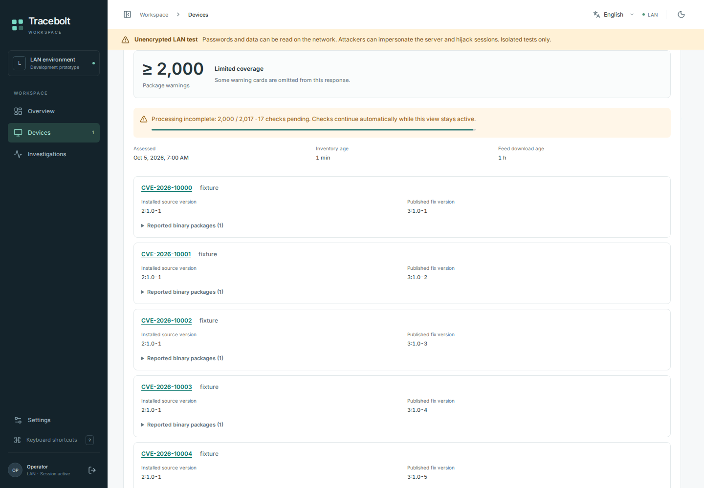
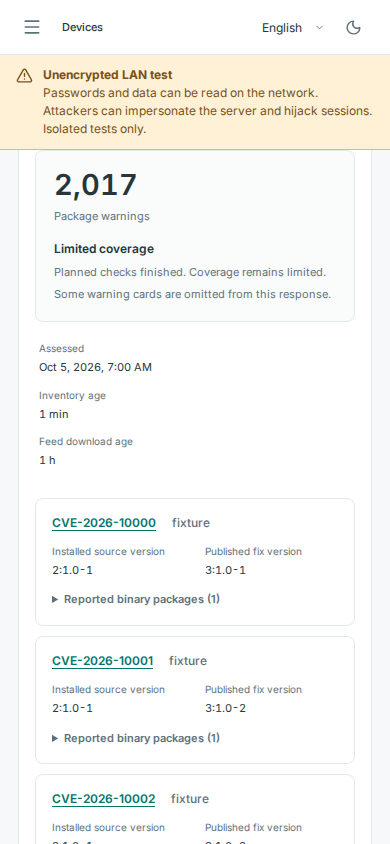

# CVE continuation previews — 81aae45

These are **synthetic test data**, not customer inventory or a real vulnerability report.
The original viewport captures come from the successful [hosted browser job](https://github.com/storminator89/Tracebolt/actions/runs/37422354151) on [source 81aae451](https://github.com/storminator89/Tracebolt/tree/81aae451da392e63e0611bf16869665fa1c85d09).

The browser artifact contains 119 passing cases, including all 14 LAN cases,
three existing enrollment quarantines and zero runtime errors. Both images were
inspected for readable totals, progress and warning content. Exact archive/image
hashes, dimensions and source identity are in [manifest.json](manifest.json).

## Desktop: bounded work continues

The fixture has completed 2,000 of 2,017 planned checks. The warning count remains
a lower bound while 17 checks are pending; continuation runs only while the
protected view remains active.

## Mobile: planned checks complete

The same synthetic assessment has finished all 2,017 checks. Its exact total is
visible, while the view still explains that vulnerability coverage is limited.
The first warning card remains readable at 390 pixels.

These images precede later full warning/binary-detail browsing and show the
then-bounded preview. They do not establish complete vendor coverage, access to
all detail rows, native deployment, host grants or a real endpoint assessment.
