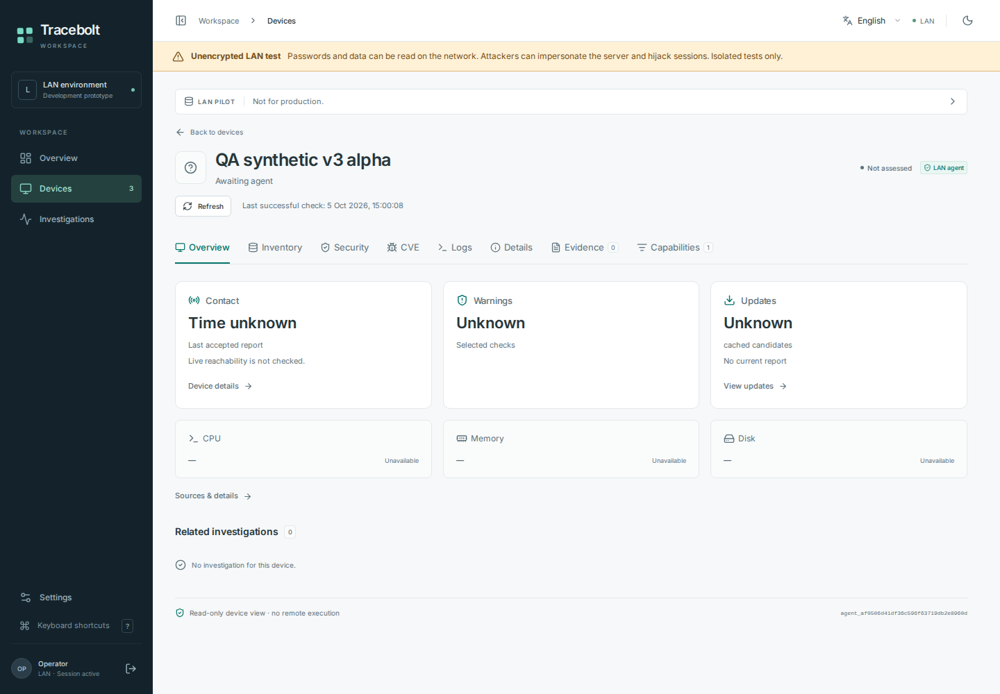
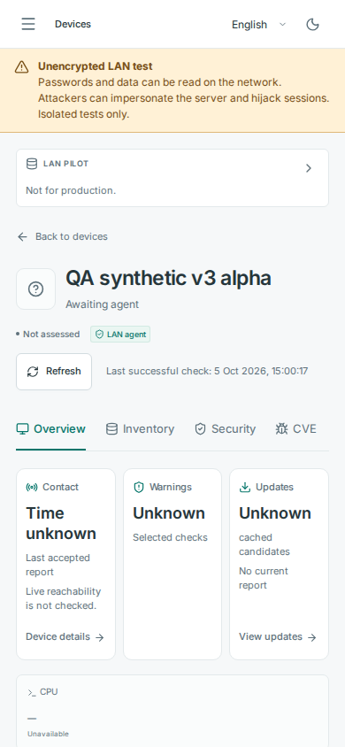

# Device overview previews — synthetic test data

These unmodified browser screenshots were rendered from exact source
`ab5de596e79e92ad89376364953cd4cf9e78a016` in
[the hosted browser run](https://github.com/storminator89/Tracebolt/actions/runs/37328086463).
They show invented v3 inventory through an authenticated loopback HTTP-test
fixture, not a customer machine. The warning remains visible; unavailable
measurements remain unknown. No native collector, helper, installer or user VM
was exercised by these screenshots.

The selected browser cases passed, including the explicit card typography and
viewport checks. The images are visual evidence for that source, not a claim of
installed-service, upgrade or reboot acceptance. The [manifest](manifest.json)
records source, run, original artifact, image hashes and viewport sizes.

## Desktop — 1440 × 1000

## Mobile — 390 × 844

